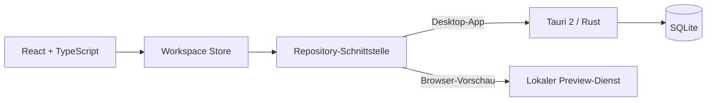

<div align="center">


# TaskHub

**Ein lokaler, ruhiger Arbeitsplatz für Projekte, Aufgaben und konzentriertes Arbeiten.**

[](#projektstatus)
[](https://v2.tauri.app/)
[](https://react.dev/)
[](https://www.typescriptlang.org/)
[](https://sqlite.org/)

[Features](#features) · [Starten](#lokal-starten) · [Architektur](#architektur) · [Roadmap](#roadmap)

</div>

---

TaskHub verbindet ein frei anpassbares Kanban-Board mit einem Focus-Timer. Ideen werden zu Karten, Karten zu sichtbaren nächsten Schritten und eine Aufgabe kann für eine Focus-Session in den Mittelpunkt rücken. Der aktuelle Stand ist als lokale Desktop-App für Linux gedacht und berücksichtigt Windows von Anfang an.

> [!NOTE]
> TaskHub ist aktuell eine **0.1 Preview**. Die App eignet sich zum Testen der Kernidee, ist aber noch kein fertiges Release.

## Features

| | Funktion | Nutzen |
|---|---|---|
| 🗂️ | **Projekte und Boards** | Jedes Projekt besitzt sein eigenes Board mit frei benennbaren Spalten. |
| ✨ | **Drag & Drop** | Aufgaben und ganze Spalten lassen sich direkt am Cursor verschieben. |
| ✅ | **Aufgabenkarten** | Beschreibungen, Checklisten, Prioritäten, Links, Bilder, Abhängigkeiten und Focus-Notizen. |
| 🔎 | **Suche und Filter** | Projektübergreifend nach Aufgaben suchen und nach Priorität filtern. |
| 🗄️ | **Archiv** | Abgeschlossene Aufgaben durchsuchen, filtern, markieren und dauerhaft löschen. |
| ⏱️ | **Focus-Timer** | Aufgabe hineinziehen, Zeit wählen, Checkliste abhaken und Notizen festhalten. |
| 🔔 | **Cozy-Chimes** | Klang, Lautstärke und Ablaufklang des Timers individuell einstellen. |
| 👥 | **Gemeinsame Boards** | Mitglieder zu Boards hinzufügen und gemeinsam daran arbeiten. |
| 🎨 | **Vier Themes** | Cyberpunk, Hell, Dunkel und Kaffee. |
| 🔒 | **Lokale Speicherung** | Workspace-Daten werden automatisch lokal persistiert. |

## Ein Workflow, der bei der Aufgabe bleibt

```text
Projekt anlegen  →  Karten ordnen  →  Aufgabe wählen  →  Focus-Zeit starten
      ↑                                                        │
      └───── Checkliste, Notizen und Fortschritt bleiben ─────┘
```

Im Archiv durchsucht die Volltextsuche auch Beschreibungen, Checklisten, URLs, Bildnamen und Focus-Notizen. So bleiben selbst ältere Gedanken wieder auffindbar.

## Lokal starten

### Voraussetzungen

- [Node.js](https://nodejs.org/) **22 oder neuer**
- npm (wird mit Node.js installiert)
- Für die Desktop-App zusätzlich Rust Stable, Cargo und die [Tauri-Systemvoraussetzungen](https://v2.tauri.app/start/prerequisites/)

### Browser-Vorschau

```bash
git clone https://github.com/kaffeeliebhaber/TaskHub.git
cd TaskHub
npm ci
npm run dev
```

Danach im Browser [http://localhost:1420](http://localhost:1420) öffnen. Die Vorschau ist nur auf dem eigenen Computer erreichbar. Die Landingpage befindet sich unter `/landing`.

Beim ersten Start werden die lokalen Testprofile **Sascha** und **Jessica** angelegt. Das anfängliche Passwort lautet jeweils `1234` und sollte anschließend im Profil geändert werden.

### Linux-Desktop-App

Unter Ubuntu 24.04 oder Linux Mint werden üblicherweise diese Pakete benötigt:

```bash
sudo apt update
sudo apt install build-essential curl wget file libssl-dev pkg-config \
  libwebkit2gtk-4.1-dev libayatana-appindicator3-dev librsvg2-dev patchelf

npm ci
npm run tauri dev
```

Ein installierbares Linux-Paket wird mit folgendem Befehl erstellt:

```bash
npm run tauri build -- --bundles deb,appimage
```

### Windows

Benötigt werden Node.js ab 22, Rust Stable mit MSVC-Toolchain, Microsoft C++ Build Tools und WebView2.

```powershell
npm ci
npm run tauri dev
npm run tauri build -- --bundles nsis
```

## Qualität prüfen

```bash
npm run build
npm test
```

Die automatisierten Tests decken das Domänenmodell, Archiv- und Focus-Verhalten ab. Ergänzende Hinweise stehen in [TESTING.md](docs/TESTING.md).

## Architektur



Die UI kennt nur die Repository-Schnittstelle. Dadurch bleiben Speicherung und Oberfläche getrennt und eine spätere Web-API oder Synchronisierung kann ergänzt werden, ohne die Karten- und Boardlogik neu zu schreiben. Details stehen in [ARCHITECTURE.md](docs/ARCHITECTURE.md).

## Roadmap

- [x] Projekte, Boards, Aufgaben und frei definierbare Spalten
- [x] Checklisten, Prioritäten, Suche, Archiv und Kartenfunktionen
- [x] Focus-Timer mit Notizen, Checkliste und optionalem Ablaufklang
- [x] Lokale Persistenz, Profile, Mitglieder und Themes
- [x] Obsidian-Canvas-Export
- [ ] Labels, Gruppen, Termine und weitere Filter
- [ ] Backups und Wiederherstellung
- [ ] Installationspakete für Linux und Windows
- [ ] Optionale Web-Version mit Synchronisierung

## Projektstatus

TaskHub wird aktiv entwickelt. Feedback, konkrete Verbesserungsvorschläge und reproduzierbare Fehlerberichte helfen sehr. Wenn dir das Projekt gefällt, unterstützt ein **Star** auf GitHub die Sichtbarkeit.

<div align="center">

**Dein Tempo. Dein System.**

Gebaut mit Tauri, React, TypeScript und SQLite.

</div>
