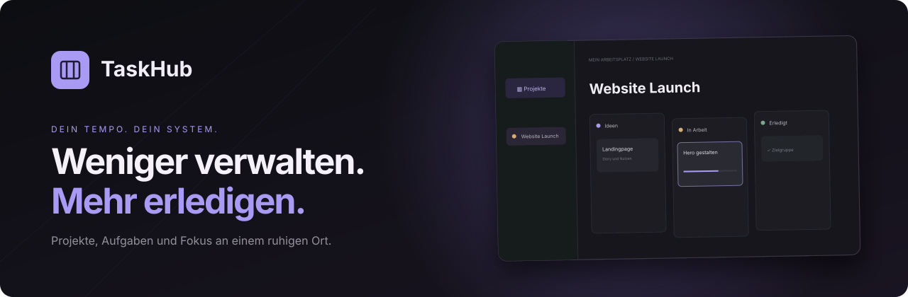
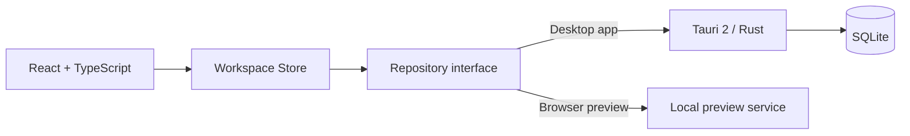

<div align="center">



# TaskHub

**A calm, local workspace for projects, tasks, and focused work.**

[](#project-status)
[](https://v2.tauri.app/)
[](https://react.dev/)
[](https://www.typescriptlang.org/)
[](https://sqlite.org/)

[Features](#features) · [Get started](#get-started-locally) · [Architecture](#architecture) · [Roadmap](#roadmap)

</div>

---

TaskHub brings a flexible Kanban board and a built-in focus timer into one desktop workspace. Capture an idea, turn it into a visible next step, and bring a single task into focus when it is time to work. The current release is local-first, built primarily for Linux with Windows compatibility in mind.

> [!NOTE]
> TaskHub is an active **0.1 preview**. It is ready for hands-on testing, but it is not a finished release yet.

## See TaskHub in action

### Flexible boards

Create projects, shape columns around your workflow, and move tasks or entire columns with direct drag and drop.

### Focus without context switching

Drag a task into the Focus Timer, choose a duration, work through its checklist, and write notes without leaving the task behind.

## Features

| | Feature | Why it helps |
|---|---|---|
| 🗂️ | **Projects and boards** | Every project has its own board with freely named columns. |
| ✨ | **Direct drag and drop** | Move tasks and whole columns while they stay visually attached to the cursor. |
| ✅ | **Rich task cards** | Descriptions, checklists, priorities, links, images, dependencies, and focus notes. |
| 🔎 | **Search and filters** | Find tasks across projects and filter them by priority. |
| 🗄️ | **Archive** | Search, filter, select, restore, or permanently remove completed work. |
| ⏱️ | **Focus Timer** | Pull in a task, keep its checklist visible, and capture notes during a session. |
| 🔔 | **Cozy chimes** | Choose the timer sound, its volume, and whether a chime plays when time runs out. |
| 👥 | **Shared boards** | Invite members to a board and work on it together. Only its creator can delete it. |
| 🎨 | **Four themes** | Cyberpunk, Light, Dark, and Coffee. |
| 🔒 | **Local persistence** | Workspace data is saved automatically on your own device. |

## A workflow that stays with the task

```text
Create a project  →  organise cards  →  choose a task  →  start a focus session
       ↑                                                              │
       └────────── checklist, notes, and progress stay connected ────┘
```

Archive search also looks through descriptions, checklist entries, URLs, image names, and Focus Notes. Older decisions remain easy to find.

## Get started locally

### Requirements

- [Node.js](https://nodejs.org/) **22 or newer**
- npm, included with Node.js
- For the desktop app: Rust Stable, Cargo, and the [Tauri system prerequisites](https://v2.tauri.app/start/prerequisites/)

### Browser preview

```bash
git clone https://github.com/kaffeeliebhaber/TaskHub.git
cd TaskHub
npm ci
npm run dev
```

Open [http://localhost:1420](http://localhost:1420). The preview is available only on your own computer. The landing page is available at `/landing`.

On the first launch, TaskHub creates only a local **Admin** account and asks you to define its password. No default password is stored in this repository. Create additional users from **Members** when needed.

### Linux desktop app

For Ubuntu 24.04 or Linux Mint, install the usual dependencies:

```bash
sudo apt update
sudo apt install build-essential curl wget file libssl-dev pkg-config \
  libwebkit2gtk-4.1-dev libayatana-appindicator3-dev librsvg2-dev patchelf

npm ci
npm run tauri dev
```

Build local Linux packages with:

```bash
npm run tauri build -- --bundles deb,appimage
```

### Windows

Install Node.js 22+, Rust Stable with the MSVC toolchain, Microsoft C++ Build Tools, and WebView2.

```powershell
npm ci
npm run tauri dev
npm run tauri build -- --bundles nsis
```

## Quality checks

```bash
npm run build
npm test
```

Automated tests cover the domain model, archive behaviour, and focus logic. See [TESTING.md](docs/TESTING.md) for further guidance.

## Architecture



The UI depends on a repository interface rather than a storage implementation. This keeps the interface separate from persistence and leaves room for a future web API or synchronisation. More detail is available in [ARCHITECTURE.md](docs/ARCHITECTURE.md).

## Roadmap

- [x] Projects, boards, tasks, and flexible columns
- [x] Checklists, priorities, search, archive, and configurable cards
- [x] Focus Timer with notes, checklists, and an optional completion chime
- [x] Local persistence, profiles, members, and themes
- [x] Obsidian Canvas export
- [ ] Labels, groups, due dates, and advanced filters
- [ ] Backups and restore flows
- [ ] Installation packages for Linux and Windows
- [ ] Optional web version and device synchronisation

## Project status

TaskHub is actively developed. Feedback, focused feature requests, and reproducible bug reports are welcome. If you like the idea, a GitHub **star** helps more people discover it.

<div align="center">

**Your pace. Your system.**

Built with Tauri, React, TypeScript, and SQLite.

</div>
