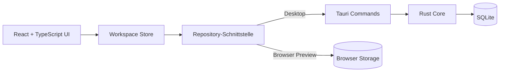

<div align="center">


# TaskHub

**Ein ruhiger, lokaler Arbeitsplatz für Projekte, Aufgaben und konzentriertes Arbeiten.**

[](#projektstatus)
[](https://v2.tauri.app/)
[](https://react.dev/)
[](https://www.typescriptlang.org/)
[](https://sqlite.org/)

[Features](#was-taskhub-besonders-macht) · [Lokal starten](#lokal-starten) · [Architektur](#architektur) · [Roadmap](#roadmap)

</div>

---

TaskHub verbindet ein flexibles Kanban-Board mit einem integrierten Focus Timer. Die App hilft dabei, Gedanken schnell festzuhalten, Arbeit sichtbar zu machen und dann genau eine Aufgabe in den Mittelpunkt zu stellen. Alle Daten bleiben in der Desktop-App lokal auf dem eigenen Gerät.

> [!NOTE]
> TaskHub befindet sich aktuell in einer **0.1-Preview**. Die Oberfläche und Kernfunktionen können bereits getestet werden; Installationspakete und eine öffentliche Web-Version folgen später.

## Was TaskHub besonders macht

| | Funktion | Was sie dir bringt |
|---|---|---|
| 🗂️ | **Flexible Boards** | Eigene Projekte, frei definierbare Spalten und eine anpassbare Arbeitsweise. |
| ✨ | **Natürliches Drag & Drop** | Karten und ganze Spalten bewegen sich sichtbar mit dem Cursor. |
| ⏱️ | **Integrierter Focus Timer** | Eine Aufgabe in den Timer ziehen und ohne Ablenkung daran arbeiten. |
| ✅ | **Checklisten** | Große Aufgaben in kleine, sichtbare Schritte zerlegen und direkt abhaken. |
| 🚦 | **Prioritäten** | Wichtige Aufgaben erkennen und gezielt danach filtern. |
| 🔎 | **Projektübergreifende Suche** | Aufgaben über Titel, Beschreibung und Priorität wiederfinden. |
| 📝 | **Verknüpfte Focus-Notizen** | Gedanken während einer Session festhalten und später an der Aufgabe sehen. |
| 🎨 | **Vier Themes** | Hell, Dunkel, Cyberpunk oder Kaffee – passend zur eigenen Atmosphäre. |
| 🔒 | **Lokale Datenhaltung** | Die Desktop-App speichert automatisch in SQLite und funktioniert offline. |

## Focus ohne Kontextwechsel

Der Focus Timer ist Teil des Workflows und kein separates Werkzeug. Eine Karte kann direkt aus dem Board in den Timer gezogen werden. Während der Session bleiben Aufgabe, Checkliste und Notizen sichtbar. Nach dem Beenden landet alles wieder am richtigen Ort.

```text
Aufgabe wählen  →  Focus-Zeit einstellen  →  konzentriert arbeiten
      ↑                                               │
      └──────── Notizen und Fortschritt bleiben ──────┘
```

## Lokal starten

### Browser-Vorschau

Voraussetzung ist [Node.js](https://nodejs.org/) ab Version 22 einschließlich npm.

```bash
git clone https://github.com/kaffeeliebhaber/TaskHub.git
cd TaskHub
npm ci
npm run dev
```

Anschließend [http://localhost:1420](http://localhost:1420) öffnen. Das Board öffnet sich direkt. Die Landingpage bleibt unter `/landing` erreichbar.

Die Browser-Vorschau verwendet ebenfalls eine lokale SQLite-Datenbank. Beim ersten Start werden die Profile **Sascha** und **Jessica** angelegt; beide verwenden zunächst das Passwort `1234`. Bitte das Passwort anschließend über „Mein Profil“ ändern.

Boards werden für ihren Eigentümer angelegt. Über den Button „Mitglieder“ kann der Eigentümer Jessica oder Sascha hinzufügen; danach sehen beide dasselbe Board und können darin arbeiten. Persönliche Einstellungen wie Sprache, Theme und Kartenfunktionen bleiben dabei pro Benutzer getrennt.

### Desktop-App unter Linux

Zusätzlich werden Rust Stable, Cargo und die [Tauri-Systemabhängigkeiten](https://v2.tauri.app/start/prerequisites/) benötigt. Unter Ubuntu 24.04 oder entsprechendem Linux Mint:

```bash
sudo apt update
sudo apt install build-essential curl wget file libssl-dev pkg-config \
  libwebkit2gtk-4.1-dev libayatana-appindicator3-dev librsvg2-dev patchelf

npm ci
npm run tauri dev
```

Ein lokales Linux-Paket wird mit `npm run tauri build -- --bundles deb,appimage` erstellt.

### Windows

Unter Windows werden Node.js ab Version 22, Rust Stable mit MSVC-Toolchain, Microsoft C++ Build Tools und WebView2 benötigt.

```powershell
npm ci
npm run tauri dev
npm run tauri build -- --bundles nsis
```

## Architektur



Die Oberfläche ist von der Speicherung getrennt. In der Desktop-App verarbeitet ein eigenständiger Rust-Kern die SQLite-Datenbank. Die Browser-Vorschau nutzt denselben Workspace über eine alternative Repository-Implementierung. Diese Trennung schafft die Grundlage für eine spätere Web-API und Synchronisation. Mehr dazu steht in der [Architekturdokumentation](docs/ARCHITECTURE.md).

## Daten und Datenschutz

Die Desktop-App speichert Projekte, Spalten, Aufgaben, Checklisten, Prioritäten, Focus-Sessions, Notizen und Einstellungen automatisch in einer lokalen SQLite-Datenbank. Der Speicherort wird in den App-Einstellungen angezeigt. Vor einer Schema-Migration erstellt TaskHub automatisch eine Sicherung.

## Qualität

```bash
npm run build
npm test
cargo test -p taskhub-core --locked
```

Die Tests decken das Domänenmodell, Focus-Verhalten und die SQLite-Migrationen ab. Weitere Prüfschritte stehen in [TESTING.md](docs/TESTING.md).

## Roadmap

- [x] Projekte, Boards, flexible Spalten und Aufgabenkarten
- [x] Animiertes Drag & Drop für Karten und Spalten
- [x] Checklisten, Prioritäten, Suche und Filter
- [x] Focus Timer mit Aufgaben, Notizen und Checklisten
- [x] Lokale SQLite-Persistenz und Themes
- [x] Öffentliche Landingpage als Browser-Einstieg
- [ ] Aufgaben-Detailansicht als Seitenpanel
- [ ] Labels, Gruppen, Termine und erweiterte Filter
- [ ] Backups, Wiederherstellung und Papierkorb
- [ ] Installationspakete für Linux und Windows
- [ ] Optionale Konten, Web-Version und Gerätesynchronisation

## Projektstatus

TaskHub wird aktiv entwickelt. Die Version 0.1 ist ein funktionaler Teststand und noch kein fertiges Release. Feedback, reproduzierbare Fehlerberichte und konkrete Verbesserungsvorschläge sind willkommen.

Wenn dir die Idee gefällt, kannst du das Projekt mit einem **Star** unterstützen. Dadurch bleibt es leichter auffindbar und du siehst die weitere Entwicklung.

---

<div align="center">

**Dein Tempo. Dein System.**

Gebaut mit Tauri, React, TypeScript und SQLite.

</div>

## Neu: Archiv und erweiterte Aufgaben

Abschlussdatum, gefilterte Archivierungsjobs, Wiederherstellung, Bildanhänge, Links, Abhängigkeiten, einklappbare Karten und Obsidian-Canvas-Export sind verfügbar. Bedienung und Grenzen: [Testanleitung](docs/TASK-TOOLS.md).
